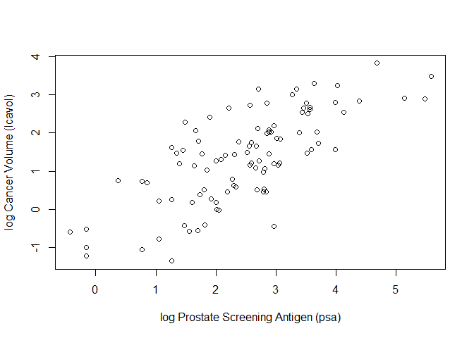
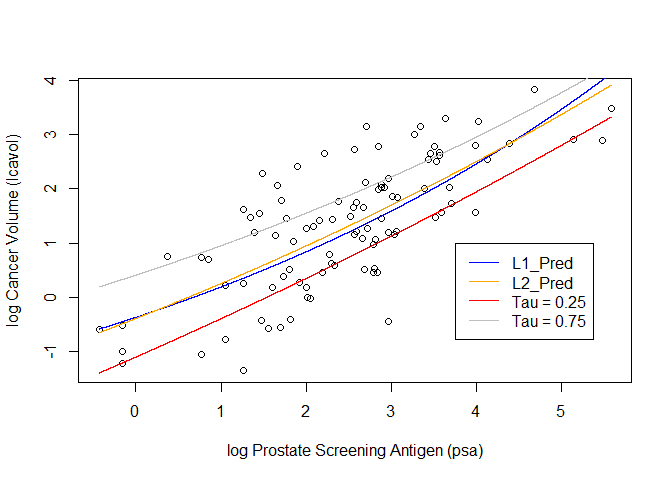

Homework 1
================
Yaqoob, Ali
January 22, 2020

## Libraries

``` r
library('ElemStatLearn')
```

## Loading Data

``` r
## load prostate data
data("prostate")
```

## Subset Training Data

``` r
## subset to training examples
prostate_train <- subset(prostate, train=TRUE)
```

## plot lcavol vs lpsa

``` r
plot_psa_data <- function(dat=prostate_train) {
  plot(dat$lpsa, dat$lcavol,
       xlab="log Prostate Screening Antigen (psa)",
       ylab="log Cancer Volume (lcavol)")
}
plot_psa_data()
```

<!-- -->

# Setup

## Loss Functions Defined

``` r
## L2 loss function
L2 <- function(y, yhat)
  (y-yhat)^2

## L1 loss function
L1 <- function(y, yhat)
  abs(y-yhat)

## Tilted Loss with tau value as 0.25
TL_1 <- function(y,yhat,tau=0.25){
  ifelse((y-yhat)>0,(tau*(y-yhat)),(tau-1)*(y-yhat))
}

## Tilted Loss with tau value as 0.75
TL_2 <- function(y,yhat,tau=0.75){
  ifelse((y-yhat)>0,(tau*(y-yhat)),(tau-1)*(y-yhat))
}
```

## Linear Model

``` r
## fit simple linear model using numerical optimization
fit_lin <- function(y, x, loss=L1_loss, beta_init = c(-0.51, 0.75)) {
  err <- function(beta)
    mean(loss(y,  beta[1] + beta[2]*x))
  beta <- optim(par = beta_init, fn = err)
  return(beta)
}
```

## Non Linear Model

``` r
fit_non_lin <- function(y, x, loss=L1_loss, beta_init = c(-1.0, 0.0, -0.3)) {
  err <- function(beta)
    mean(loss(y, beta[1] + beta[2]*exp(-beta[3]*x)))
  beta <- optim(par = beta_init, fn = err)
  return(beta)
}
```

# Fitting the Linear Models

``` r
lin_beta_L1 <- fit_lin(y=prostate_train$lcavol,
                    x=prostate_train$lpsa,
                    loss=L1)

lin_beta_L2 <- fit_lin(y=prostate_train$lcavol,
                    x=prostate_train$lpsa,
                    loss=L2)

lin_beta_TL_1 <- fit_lin(y=prostate_train$lcavol,
                    x=prostate_train$lpsa,
                    loss=TL_1)

lin_beta_TL_2 <- fit_lin(y=prostate_train$lcavol,
                    x=prostate_train$lpsa,
                    loss=TL_2)
```

## Make Predictions From the Betas Created By The Linear Models

``` r
predict_lin <- function(x, beta)
  beta[1] + beta[2]*x
```

``` r
x_grid <- seq(min(prostate_train$lpsa),
              max(prostate_train$lpsa),
              length.out=100000)

lin_pred_L1 <- predict_lin(x=x_grid, beta=lin_beta_L1$par)

lin_pred_L2 <- predict_lin(x=x_grid, beta=lin_beta_L2$par)

lin_pred_TL_1 <- predict_lin(x=x_grid, beta=lin_beta_TL_1$par)

lin_pred_TL_2 <- predict_lin(x=x_grid, beta=lin_beta_TL_2$par)
```

``` r
## plot data
plot_psa_data()

## plot predictions
lines(x=x_grid, y=lin_pred_L1,col='blue')
lines(x=x_grid, y=lin_pred_L2,col='orange')
lines(x=x_grid, y=lin_pred_TL_1,col='red')
lines(x=x_grid, y=lin_pred_TL_2,col='grey')
legend(3.75,1,legend = c("L1_Pred","L2_Pred","Tau = 0.25","Tau = 0.75"),
                lty = c(1,1,1,1),
                         col = c("blue","orange","red","grey" ))
```

<!-- -->

# Fitting the Non-Linear Models

``` r
lin_beta_L1 <- fit_non_lin(y=prostate_train$lcavol,
                    x=prostate_train$lpsa,
                    loss=L1)

lin_beta_L2 <- fit_non_lin(y=prostate_train$lcavol,
                    x=prostate_train$lpsa,
                    loss=L2)

lin_beta_TL_1 <- fit_non_lin(y=prostate_train$lcavol,
                    x=prostate_train$lpsa,
                    loss=TL_1)

lin_beta_TL_2 <- fit_non_lin(y=prostate_train$lcavol,
                    x=prostate_train$lpsa,
                    loss=TL_2)
```

## Make Predictions From the Betas Created By The Non Linear Models

``` r
predict_lin <- function(x, beta)
  beta[1] + beta[2]*exp(-beta[3]*x)
```

``` r
x_grid <- seq(min(prostate_train$lpsa),
              max(prostate_train$lpsa),
              length.out=100000)

lin_pred_L1 <- predict_lin(x=x_grid, beta=lin_beta_L1$par)

lin_pred_L2 <- predict_lin(x=x_grid, beta=lin_beta_L2$par)

lin_pred_TL_1 <- predict_lin(x=x_grid, beta=lin_beta_TL_1$par)

lin_pred_TL_2 <- predict_lin(x=x_grid, beta=lin_beta_TL_2$par)
```

``` r
## plot data
plot_psa_data()

## plot predictions
lines(x=x_grid, y=lin_pred_L1,col='blue')
lines(x=x_grid, y=lin_pred_L2,col='orange')
lines(x=x_grid, y=lin_pred_TL_1,col='red')
lines(x=x_grid, y=lin_pred_TL_2,col='grey')
legend(3.75,1,legend = c("L1_Pred","L2_Pred","Tau = 0.25","Tau = 0.75"),
                lty = c(1,1,1,1),
                         col = c("blue","orange","red","grey" ))
```

<!-- -->
