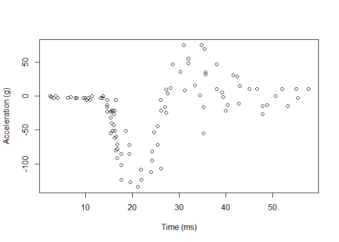
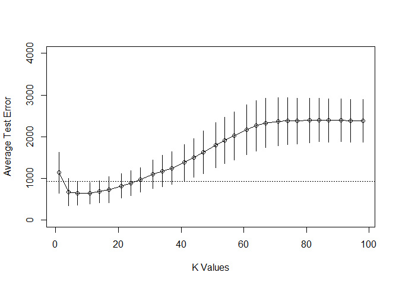

Homework 3
================
Yaqoob, Ali
March 15, 2020

``` r
library('MASS') ## for 'mcycle'
library('manipulate') ## for 'manipulate'
```

1.  Randomly split the mcycle data into training (75%) and validation
    (25%) subsets.

<!-- end list -->

``` r
set.seed(42)
data <- mcycle
sample <- sample.int(n = nrow(data), size = floor(.75*nrow(data)), replace = F)
train <- data[sample, ]
test  <- data[-sample, ]
```

``` r
yt <- train$accel
xt <- matrix(train$times, length(train$times), 1)
yv <- test$accel
xv <-matrix(test$times, length(test$times), 1)
```

``` r
plot(xt, yt, xlab="Time (ms)", ylab="Acceleration (g)")
```

<!-- -->

2.  Using the mcycle data, consider predicting the mean acceleration as
    a function of time. Use the Nadaraya-Watson method with the k-NN
    kernel function to create a series of prediction models by varying
    the tuning parameter over a sequence of values.

<!-- end list -->

``` r
## k-NN kernel function
## x  - n x p matrix of training inputs
## x0 - 1 x p input where to make prediction
## k  - number of nearest neighbors
kernel_k_nearest_neighbors <- function(x, x0, k=1) {
  ## compute distance betwen each x and x0
  z <- t(t(x) - x0)
  d <- sqrt(rowSums(z*z))

  ## initialize kernel weights to zero
  w <- rep(0, length(d))
  
  ## set weight to 1 for k nearest neighbors
  w[order(d)[1:k]] <- 1
  
  return(w)
}
```

``` r
## Make predictions using the NW method
## y  - n x 1 vector of training outputs
## x  - n x p matrix of training inputs
## x0 - m x p matrix where to make predictions
## kern  - kernel function to use
## ... - arguments to pass to kernel function
nadaraya_watson <- function(y, x, x0, kern, ...) {
  k <- t(apply(x0, 1, function(x0_) {
    k_ <- kern(x, x0_, ...)
    k_/sum(k_)
  }))
  yhat <- drop(k %*% y)
  attr(yhat, 'k') <- k
  return(yhat)
}
```

Create models for different values of k

``` r
## Create models using NW method and KNN Kernel
## y  - n x 1 vector of training outputs
## x  - n x p matrix of training inputs
## x0 - m x p matrix where to make predictions
## kstart  - starting value of tuning parameter
## kend  - end value of tuning parameter
## ksize - size of the vector to tune over

nwk_models <- function(y, x, x0, kstart = 1, kend = 98, ksize = 30){
  k <- seq(kstart,kend,length.out = ksize)
  k <- floor(k)
  pred_mat <- matrix( nrow = length(k), ncol = length(x0))
  
  x_plot <- matrix(seq(min(x),max(x),length.out=100),100,1)
  
  for(i in 1:length(k)){
    pred_mat[i,] <- nadaraya_watson(y, x, x0,
                                    kern = kernel_k_nearest_neighbors, k = k[i])
  }
  
  pred_mat
}
```

3.  With the squared-error loss function, compute and plot the training
    error, AIC, BIC, and validation error (using the validation data) as
    functions of the tuning parameter.

Compute and plot the training error as functions of the tuning
parameter.

``` r
## loss function
## y    - train/test y
## yhat - predictions at train/test x
loss_squared_error <- function(y, yhat)
  (y - yhat)^2
```

``` r
## test/train error
## y    - train/test y
## yhat - predictions at train/test x
## loss - loss function
error <- function(y, yhat, loss=loss_squared_error)
  mean(loss(y, yhat))
```

``` r
ksize = 30
train_pred <- nwk_models(yt, xt, xt, ksize = ksize)
training_error <- rep(NA, nrow(train_pred))

for(i in 1:length(training_error)){
  training_error[i] <- error(yt, train_pred[i,])
}
kvals = floor(seq(1,98,length.out = ksize))
plot(x =kvals,y=training_error, ylab = "Training Error", xlab = "K Values",type = 'o')
```

<!-- -->

Compute and plot the AIC and BIC as a function of the tuning parameter.

``` r
## Compute effective df using NW method
## y  - n x 1 vector of training outputs
## x  - n x p matrix of training inputs
## kern  - kernel function to use
## ... - arguments to pass to kernel function
effective_df <- function(y, x, kern, ...) {
  y_hat <- nadaraya_watson(y, x, x,
    kern=kern, ...)
  sum(diag(attr(y_hat, 'k')))
}

## AIC
## y    - training y
## yhat - predictions at training x
## d    - effective degrees of freedom
aic <- function(y, yhat, d)
  error(y, yhat) + 2/length(y)*d

## BIC
## y    - training y
## yhat - predictions at training x
## d    - effective degrees of freedom
bic <- function(y, yhat, d)
  error(y, yhat) + (log(length(y))/length(y))*d

aic_vals <- rep(NA, nrow(train_pred))
bic_vals <- rep(NA, nrow(train_pred))
for(i in 1:length(aic_vals)){
  ## compute effective degrees of freedom
  edf <- effective_df(yt, xt, kern = kernel_k_nearest_neighbors, k = kvals[i])
  #print(edf)
  aic_vals[i] <- aic(yt, train_pred[i,], edf)
  bic_vals[i] <- bic(yt, train_pred[i,], edf)
}

par(mfrow = c(1,2))
plot(x =kvals, y=bic_vals, ylab = "BIC", xlab = "K Values", type = 'o')
plot(x =kvals, y=aic_vals, ylab = "AIC", xlab = "K Values", type = 'o')
```

<!-- -->

Compute and plot validation error as function of tuning parameter.

``` r
valid_pred <- nwk_models(yt,xt,xv,ksize = 30)
validation_error <- rep(NA, nrow(valid_pred))

for(i in 1:length(training_error)){
  validation_error[i] <- error(yv, valid_pred[i,])
}
kvals = floor(seq(1,98,length.out = ksize))
par(xpd = T)
plot(x =kvals,y=training_error, ylab = "Error", xlab = "K Values",type = 'l', ylim = c(0,3500), col = "red")
lines(x = kvals, y = validation_error, col = "blue", lty = 2)
legend(1, 2500, legend=c("Training Error", "Validation Error"),
       col=c("red", "blue"), lty=1:2, cex=0.8)
```

<!-- -->

4.  For each value of the tuning parameter, Perform 5-fold
    cross-validation using the combined training and validation data.
    This results in 5 estimates of test error per tuning parameter
    value.

<!-- end list -->

``` r
n_train <- nrow(mcycle)
n_folds <- 5
folds_i <- sample(rep(1:n_folds, length.out = n_train))
cv_test_error <- matrix(nrow = n_folds, ncol = length(kvals))

for(j in 1:length(kvals) ){
  for(i in 1:n_folds){
    train_ind <- which(folds_i != i)
    test_ind <- which(folds_i == i)
    train_k <- mcycle[train_ind,]
    test_k <- mcycle[test_ind,]
    yt <- train_k$accel
    xt <- matrix(train_k$times, length(train_k$times), 1)
    yv <- test_k$accel
    xv <-matrix(test_k$times, length(test_k$times), 1)
    yv_hat <- nadaraya_watson(yt, xt, xv,
                             kern = kernel_k_nearest_neighbors, k = kvals[j])
    cv_test_error[i,j] <-  error(yv, yv_hat)

  }
}


cv_test_error <- as.data.frame(cv_test_error)
colnames(cv_test_error) <- kvals
cv_test_error
```

    ##           1        4        7       11       14        17        21        24
    ## 1 1506.8122 956.8403 891.8896 741.4860 760.4413  752.8662  815.2303  872.9014
    ## 2 1257.8363 487.3433 488.3112 551.8236 648.9812  731.4150  878.3552  972.4274
    ## 3 1631.3381 965.5328 892.6696 906.1042 982.4477 1137.0602 1177.5043 1217.1460
    ## 4  892.6385 745.9604 728.8163 781.5634 767.4506  777.9857  879.6142  966.9196
    ## 5  412.6308 212.4542 221.6381 259.4757 252.4658  266.8055  355.2217  401.2758
    ##          27        31        34        37        41        44        47
    ## 1  918.3963 1007.9621 1050.6198 1130.9019 1244.3595 1315.0350 1405.4878
    ## 2 1022.8260 1311.8995 1423.5972 1455.2913 1614.8818 1795.7524 2002.3994
    ## 3 1283.0444 1432.9347 1608.4714 1746.5889 1960.8004 2100.8224 2274.5908
    ## 4 1109.9536 1195.7765 1189.3596 1219.2861 1301.8987 1345.9815 1452.7437
    ## 5  505.6192  548.3586  620.3937  691.2833  794.8885  916.1848  997.5295
    ##         51       54       57       61       64       67       71       74
    ## 1 1599.719 1709.832 1792.433 1898.027 1956.002 1985.552 1968.853 1937.677
    ## 2 2213.478 2334.474 2431.353 2587.728 2694.300 2736.135 2759.989 2771.703
    ## 3 2471.947 2590.545 2726.547 2883.675 2965.876 3010.092 2980.779 2940.565
    ## 4 1592.845 1752.278 1908.554 2110.720 2250.741 2410.073 2532.639 2615.104
    ## 5 1105.236 1179.966 1243.414 1350.310 1448.642 1521.747 1585.679 1632.221
    ##         77       81       84       87       91       94       98
    ## 1 1919.502 1904.008 1914.576 1903.804 1894.816 1888.065 1876.695
    ## 2 2783.251 2802.787 2815.732 2823.975 2833.664 2836.069 2834.883
    ## 3 2864.410 2794.621 2721.555 2658.450 2577.923 2522.828 2458.001
    ## 4 2667.596 2747.205 2789.268 2827.521 2860.135 2876.861 2909.857
    ## 5 1669.643 1715.420 1752.495 1760.966 1797.017 1807.960 1829.653

Each column in cv\_test\_error represents one k value (tuning parameter)
and the five CV test errors associated with each k value.

5.  Plot the CV-estimated test error (average of the five estimates from
    each fold) as a function of the tuning parameter. Add vertical line
    segments to the figure (using the segments function in R) that
    represent one “standard error” of the CV-estimated test error
    (standard deviation of the five estimates from each fold).

6.  Interpret the resulting figures and select a suitable value for the
    tuning parameter.

<!-- end list -->

``` r
cv_mean <- apply(cv_test_error, 2, mean)
cv_sd   <- apply(cv_test_error, 2, sd)


plot(x = kvals , y = cv_mean, type = 'o', ylab = "Average Test Error", xlab = "K Values", ylim = c(0,4000))
segments(x0=kvals, x1=kvals,
         y0=cv_mean - cv_sd,
         y1=cv_mean + cv_sd)
best_idx <- which.min(cv_mean)

abline(h=cv_mean[best_idx] + cv_sd[best_idx], lty=3)
```

<!-- -->

As we increase the value of k, the model tends moves towards lower
variance. Cross validation is not an optimistic measure of test error,
therefore our plot looks a lot closer to the actual validation error in
this case.

``` r
optimal <- cv_mean[best_idx] + cv_sd[best_idx]
kvals[which(abs(cv_mean - optimal) == min(abs(cv_mean - optimal)))]
```

    ## [1] 27

This is the best tuning parameter value as it is one standard deviation
of the lowest test error value.
